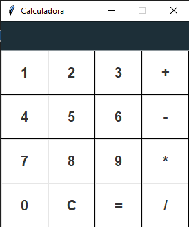

# RelogioDigital

Um script em Python utilizando interface gráfica para exibição de um relógio digital. 

# Soma

Um script em Python utilizando interface gráfica para soma entre dois números.

# Calculadora

Calculadora simples em Python utilizando interface gráfica com Tkinter.

# QRCode

Um aplicativo simples de interface gráfica capaz de gerar um QR Code de um endereço específico na web.

